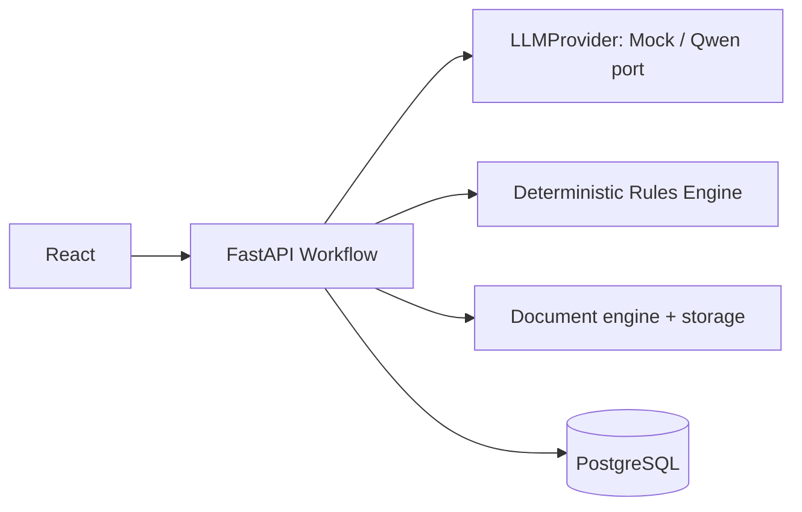

# ДПО Ассистент (MVP)

Локальный модульный монолит для подготовки закупочных обращений. Все договоры и шаблоны — **DEMO**, не корпоративные документы.



## Запуск

```bash
cp .env.example .env
docker compose up --build
```

Frontend: http://localhost:5173 · API: http://localhost:8000 · OpenAPI: http://localhost:8000/docs

Миграции и идемпотентный seed выполняются при старте backend. Отдельно: `docker compose exec backend alembic upgrade head`, `docker compose exec backend python -m app.seed`. Тесты: `docker compose exec backend pytest -q`.

Mock SSO: `ivanov` / `ivanov` (Иванов Иван Иванович), `petrova` / `petrova` (Петрова Анна Сергеевна).

## Демонстрация

1. Создайте запрос, напишите «Нам нужно заказать разработку лендинга для мероприятия».
2. Одним сообщением ответьте через `;`: «Продвижение; создать лендинг; 30 ноября; проверка заказчиком».
3. Проверьте/измените ТЗ, подтвердите — появится детерминированная рекомендация договора выполнения работ и скачивание ТЗ.
4. Запрос «Мне нужен личный юридический совет» переводится в «Обратитесь в ДПО».
5. DOCX/PDF/XLSX можно загрузить через API `POST /api/v1/cases/{id}/attachments`; парсер безопасно извлекает текст.

## Архитектура и расширение

`backend/app/ai/providers.py` содержит `LLMProvider`, mock и порт `CorporateQwenProvider`; для Qwen нужны `LLM_BASE_URL`, `LLM_API_KEY`, `LLM_MODEL`. `backend/app/integrations/ports.py` содержит порты ADFS, S3 (`S3_ENDPOINT`, `S3_BUCKET`, ключи) и DocsVision (`submit_procurement_package`). Локальное хранилище настраивается `STORAGE_LOCAL_PATH`; лимит — `MAX_UPLOAD_SIZE_MB`.

Правила лежат в `contract_template_rules` и сопоставляют структурированную `category`; отсутствие одного совпадения эскалирует в ДПО. Новое правило добавляется в seed/миграцией с JSON `conditions`. Docker Compose поднимает PostgreSQL, backend и frontend с health checks.

Ограничения MVP: mock SSO и LLM, нет реального ADFS/AIS/S3/DocsVision, upload UI минимален (endpoint полностью реализован), DEMO-шаблоны не являются юридическими документами.
